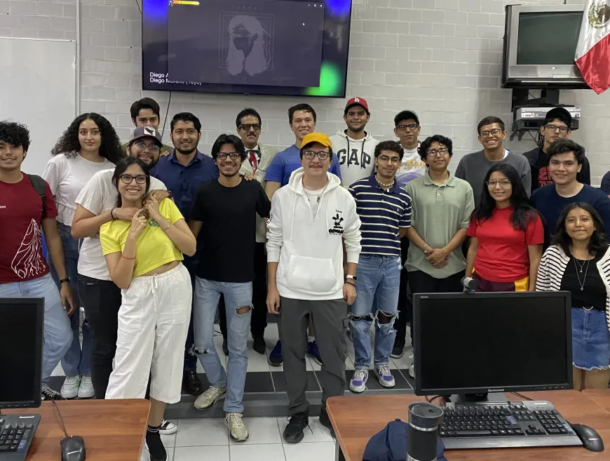
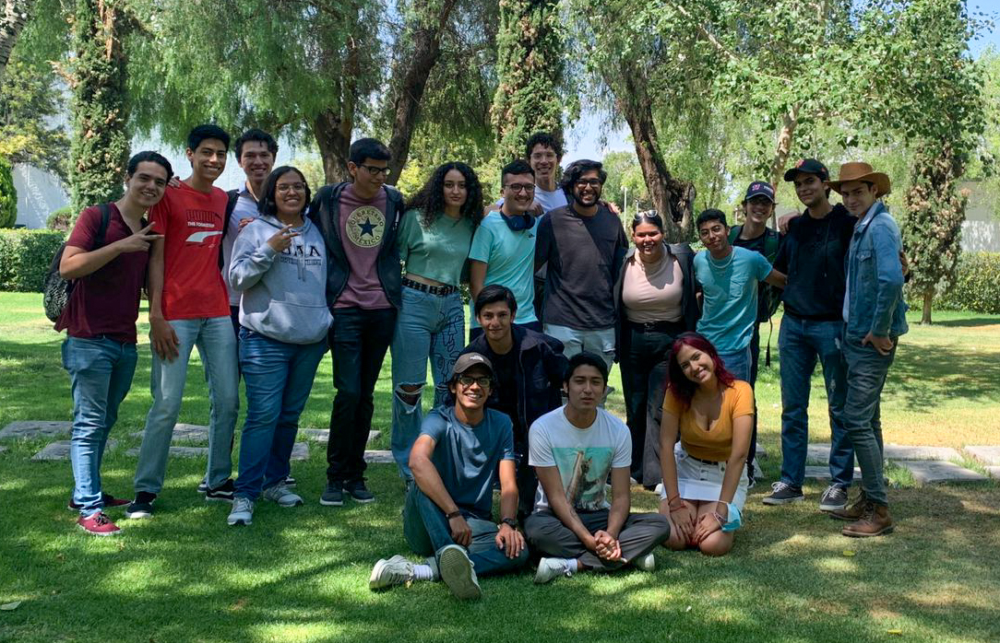

## Hello everyone! I'm Yeyo :octocat:

I'm Diego Moreno, a computer science student at Universidad Autónoma de Aguascalientes, Mex and a Site Reliability Engineer Intern at Petco. I have a strong passion for software engineering and all the exciting aspects that come with it. Throughout my academic journey, I have developed a keen interest in SRE and DevOps practices, ensuring websites are reliable and accessible for all users.
 

In addition to my technical skills, I value collaboration and effective communication within development teams. I believe in the power of teamwork and appreciate the diverse perspectives that each team member brings to the table. Some cool facts about me:
 

*  I'm a former Major League Hacking Fellow 23', Production Engineer Track, powered by META
*  Spurs fan since 2017!
*  One of my favorite hobbies is playing guitar

## Cool people

  
&nbsp; &nbsp; &nbsp; &nbsp;
  

## Yes, I do code...

